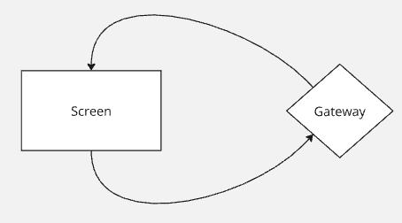
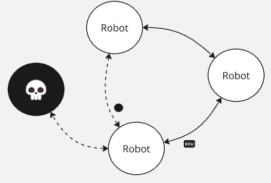
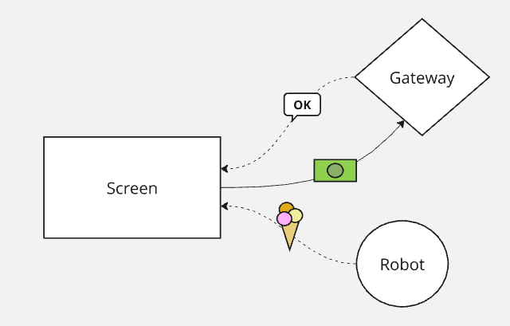

# TP2 para la materia Programación Concurrente - FIUBA

Una importante cadena de heladerías desea abrir una sucursal completamente robotizada. Los clientes harán su pedido sobre una interfáz gráfica eligiendo gustos y tamaño. Luego un conjunto de robots podrán resolver los pedidos de forma concurrente, tal como lo hacen los heladeros los días de calor. Así mismo, cada contenedor con un gusto de helado podrá ser utilizado solamente por un robot a la vez. Finalmente se le entregará su helado al cliente; y solamente se le cobrará en la tarjeta si efectivamente se pudo completar su pedido.

[Enlace a la presentación](https://www.youtube.com/watch?v=Ku7QV1wiq2o)

## Integrantes

| Nombre                                               | Padrón |
| ---------------------------------------------------- | ------ |
| [Bianchi, Marcos](https://github.com/MarcosBianchii) | 108921 |
| [Berenguel, Rafael](https://github.com/RafaB15)      | 108225 |
| [Ghosn, Lautaro Gabriel](https://github.com/LGhosn)  | 106998 |


## Pedido

Cada pedido está modelado en un archivo de tipo `.jsonl` donde la información relevante es:
- Los sabores y sus cantidades
- El número de tarjeta del cliente

El formato del archivo es de la forma

`{ "flavours": {"flavour_1": number of balls, "flavour_2": number of balls}, "card_number": "XXXX-XXXX-XXXX-XXXX"}`

## Screen

### Run
```cs
cargo run --bin screen -- <id> <path_a_archivo_de_pedidos>
```

### Diseño

Las pantallas se componen de algunas partes que trabajan entre sí con el objetivo de comunicar nuevas órdenes al ring de robots, recibir el resultado de la órden de parte de los robots y enviar información al gateway de pagos acerca del estado de la órden.

Las pantallas tienen un `thread` en el que escuchan por mensajes de los robots, quienes se intentarán comunicar con esta a través de **TCP** cuando quieran confirmar o cancelar un pedido. Por otra parte, tiene una conexión permanente con el gateway de pagos, para poder enviarle información.

### Protocolo de validación de pedidos

Cada pantalla establece una conexión con el gateway que perdura hasta que la pantalla muera donde sirve para validar pedidos del archivo de pedidos.

Por cada pedido recibido se envía una solicitud al gateway que contiene el número de tarjeta del cliente y un id de pedido para que esta pueda identificarlo.

De ser aceptado por el gateway el pedido es enviado a la red de robots utilizando **TCP**.

### Envío de pedidos a robots

Por cada pedido creado por la pantalla se crea una conección **TCP** para comunicarse con algún robot quien recibe este pedido.

Se selecciona que robot recibirá el pedido en base al número de órden para no congestionar al mismo robot por todas las pantallas. Si el robot escogido está fuera de servicio, entonces se itera sobre el rango de puertos previamente definido hasta encontrar uno que esté habilitado.

## Robot

### Run
```cs
cargo run --bin robot -- <id>
```

### Diseño

Estas entidades están modeladas usando el sistema de actores de actix.

Cada robot corre en un proceso separado donde tienen dos `TcpListener` en puertos especificos elegidos a la hora de correr el programa.

Uno de ellos corre el procedimiento `new_connections_receiver` el cual se encarga de recibir conecciones entre robots.

El otro corre el procedimiento `new_orders_receiver` que se encarga de recibir los pedidos de las pantallas.

```rust
enum RobotMsg {
    // Prev
    RecvOrderToken(OrderToken),
    RecvFlavourToken(FlavourToken),

    // Next
    Disconnect,
    EndOfUse(TokenId),

    // Screen
    RecvOrder(Order),
}
```

Recibe los pedidos mediante este mensaje por la red donde lo deserializa utilizando el crate `serde`.

### Protocolo de comunicación entre robots

```rust
struct Robot {
    prev_tx: Option<WriteHalf<TcpStream>>,
    next_tx: Option<WriteHalf<TcpStream>>,
    // ...
}
```

Elegimos implementar la comunicación entre robots usando el protocolo **TCP** donde cada uno guarda la mitad de escritura de los robots anterior y siguiente a él.

Esta implementación de la red de robots soporta conexiones esporádicas, lo que hace que nos podemos recuperar fácilmente de caidas de robots y reorganizar el anillo para continuar con el trabajo.

Cuando se establece una nueva conexión esta lanza un task de tokio donde se le concede la mitad de lectura del stream obtenido y se traducen los mensajes de la red a mensajes de actores mediante el uso de serialización y deserialización del crate `serde`.

El mismo robot sabe como dropear el stream anterior para no generar tasks zombie donde quedan esperando por algún mensaje que no va a llegar.

Así mismo, cuando nos conectamos a un nuevo robot también se lanza un task que la parte de lectura del stream del robot siguiente, para escuchar mensajes que este nos pueda llegar a mandar.

### Sección Crítica

#### Pedidos

```rust
struct OrderToken {
    sender: u16,
    orders_queue: VecDeque<Order>,
    in_progress: HashMap<u16, Order>,
}
```

Elegimos utilizar el algoritmo de Token Ring para modelar un token de pedidos el cual se pasa de robot en robot. Este lo inicia el primer robot en conectarse a la red y contiene una lista de los pedidos que mandan las pantallas.

```rust
struct Robot {
    new_orders: Vec<Order>,
    current_order: Option<Order>,
    serving_flavour: bool,
    // ...
}
```

Los robots al recibir los pedidos de las pantallas los suman a esta lista interna y al momento en el que llega el token pushean los pedidos nuevos dentro del token.

Cuando un robot recibe el token de pedidos y esta libre (no está ocupado resolviendo ningún pedido), toma el proximo y el token continua en circulación.

El token a su vez también tiene un campo **in_progress** en donde se guardan los pedidos que están siendo realizados en el momento, de modo que si otros robots se dan cuenta que el robot que se estaba encargando de ese pedido se cayó, entonces toman el pedido para hacerlo ellos. De esta forma tenemos resiliencia ante la caida de robots con órdenes, pudiendo terminarlas en vez de cancelarlas. 

#### Sabores

```rust
struct FlavourToken {
    sender: u16,
    flavour: Flavour,
    servings: usize,
}
```

Decidimos también modelar la sección crítica de los sabores de helado mediante otro algoritmo de Token Ring pero esta vez con la diferencia de que todos los sabores son un token distinto y todos van a estar ciruclando la red de robots constantemente de forma independiente.

Cuando un robot recibe el token de sabor primero se fija que sea uno de los sabores que necesita para concretar el pedido en progreso que se auto asigno al momento de recibir el token de pedidos. Luego toma la cantidad necesaria, espera el tiempo de preparación correspondiente y lo envía al próximo.

En caso de no haber la cantidad de helado requerido desecha su pedido en progreso, avisa a la pantalla y espera a que vuelva a llegar el token de pedidos para repetir el proceso conel siguiente.

En caso de terminar el helado avisa a la pantalla originadora del pedido que el pedido está completo para que esta avise al gateway que el pedido se pudo llevar a cabo con éxito.

En nuestra implementación decidimos que el tiempo que iba a demorar el robot en hacer el pedido sea 1 segundo por cada bola de helado del sabor.

### Resiliencia ante caídas de robots

Nuestra solución consiste en que cada robot está conectado al siguiente constantemente, por lo que en el momento en el que el siguiente se desconecta de la red de forma esporádica, el anterior lo nota inmediatamente.

Esto lanza un par de mensajes de actores al robot pidiendo que busque un nuevo siguiente y luego utilice una estructura especial que lleva en cuenta que tokens fueron o no pasados al siguiente y esperan un mensaje de `"ok"`.

```rust
struct TokenBox {
    order_token: Option<OrderToken>,
    flavour_tokens: HashMap<Flavour, FlavourToken>,
    // ...
}
```

Cada robot tiene una **TokenBox** que lleva en cuenta los tokens que se enviaron al siguiente.

Cuando un robot recibe un token lo manipula dependiendo cual sea (pedidos o sabor) y luego de mutarlo lo añade a su **TokenBox**.

```rust
enum RobotMsg {
    EndOfUse(TokenId),
    // ...
}
```

Una vez se envía el token al siguiente, nosotros, enviamos un mensaje de **EndOfUse** a nuestro anterior. El robot anterior no espera activamente a que le enviemos un **EndOfUse**, sino que al recibirlo retira de su **TokenBox** el token indicado en el mensaje.

Esta solución permite que al momento en el que un robot detecta que cae su siguiente, este busque a uno nuevo y envíe todos los tokens que tiene en su **TokenBox** (no recibieron un **EndOfUse**). Por lo que estaría bien suponer que el robot siguiente se cayó con ellos.

Esta lógica aplica para ambos tipos de tokens.

### Resolución de pedidos

Cuando al robot le llega el order token, se fija si hay alguna órden pendiente. Si la hay, la toma y cada vez que reciba el token de un sabor, se fijará si es el que necesita y en caso de serlo empezará a prepararlo.

El robot demorará un segundo por cada bola de helado del sabor. Al terminar, libera el token para que siga circulando por el anillo.

Al momento de finalizar un helado, el robot envía un mensaje de finalización del pedido a la pantalla creadora del mismo mediante **TCP**.

Si la pantalla que lo creó no responde, entonces intentará enviarlo a las otras pantallas dentro del rango predefinido de pantallas posibles hasta que alguna tome el mensaje y le avise al gateway que puede confirmar o cancelar el pago según sea el caso.

En caso de que se caiga un robot mientras este estaba preparando un pedido, este será tomado por otro robot como se mencionó en la sección de *pedidos*.

## Gateway

### Run
```cs
cargo run --bin gateway
```

### Implementación

Está imlementado usando **TCP** y lanza un hilo nuevo por conexión establecida donde cada conexión corresponde a una pantalla distinta, por lo que la cantidad de hilos de ejecución es poca.

### Validación de pedidos

```rust
enum GatewayMsg {
    CapturePayment(OrderId, String),
    CommitPayment(OrderId),
    CancelPayment(OrderId),
}
```

Estos son los mensajes que recibe el Gateway. se deserializan utilizando el crate `serde`.

El Gateway elige rechazar un pedido si el primer número del número de tarjeta del cliente empieza con `3`.

La devolución del mensaje **CapturePayment** es:
- `"true"` => Se validó la tarjeta del cliente
- `"false"` => La tarjeta del cliente no es válida

### Casos de falla

- Si un robot muere con nuevos pedidos antes de guardarlos en el token de pedidos, estos se pierden. Es un caso muy poco probable, dada la frecuencia con la cual se pasa el token de pedidos.

## Gráficos

### Resumen del diseño

1. Se lee el pedido del archivo de pedidos, se procesa y se arma la orden de pedido
1. Se envía al gateway la tarjeta del cliente para capturar el pago
1. El gateway responde, de ser válido se sigue, sino se ignora el pedido
1. Se envía el pedido a un robot.
1. El robot que armó el helado envía una confirmación a la pantalla de que se hizo el helado
1. Se termina de confirmar al gateway que el pedido se realizó con exito para terminar la transacción


### Comienzo de la transacción

Se envían los detalles del pago al broker y se espera por una respuesta. En caso de resultar inválida se ignora el pedido



### Anuncio de pedido

La pantalla elige un ID de robot dentro del rango para intentar mandarle el pedido. Si el robot elegido por la pantalla para mandarle el pedido no estuviera disponible se le mandaría al siguiente ID.

Se utiliza un token que se pasa con el algoritmo de Token Ring para determinar que robot introduce a la cola de pedidos el pedido recibido.

El token tiene la lista de pedidos generados por las pantallas que todavía no han sido tomados por algún robot.


Cada vez que se pasa el token al siguiente, el robot que envía necesita recibir un *End of Use* para saber que si se cae el robot al que se lo envió, no es necesario reenviar el token al siguiente, pues este ya habrá sido transmitido.



### Sección Crítica

Se usa el algoritmo de Token Ring con una modificación de varios tokens.

Cada token representa un sabor dentro de la red y guarda la cantidad de helado restante de ese sabor.

Cada vez que se pasa alguno de los tokens al siguiente, el robot que envía necesita recibir un *End of Use* para saber que si se cae el robot al que se lo envió, no es necesario reenviar el token al siguiente, pues este ya habrá sido transmitido.


### Finalización del pedido

Una vez se tienen la captura del pago y el helado, se confirma el pago al broker.



## Cambios

Desde que fue planteado el diseño original de nuestra solución hasta este puntos se fueron dado diversos cambios para mejorar la eficiencia y resiliencia de nuestra aplicación (se puede ver el readme inicial en el archivo *pre_README.md*).

El principal cambio con respecto a nuestra visión original es que al principio planteamos las comunicaciones entre los diferentes procesos corriendo en nuestro programa con UDP. Esto fue lo que más cambiamos, terminando con una implementación que termina usando TCP.

Al principio planteamos que las pantallas comunicaran las nuevas órdenes a los robots mandándole la órden a todos y que solo el que tuviera el token de pedidos en ese momento podría ingresarla. Esto generaba varios casos bordes que había que manejar y desembocaba en una gran cantidad de mensajes siendo enviados.

Decidimos en su lugar usar conexiones **TCP**, que nos garantizaban la entrega de la órden y hacían más directa la confirmación de que fue recibida.

El punto más grande de cambio con respecto a la implementación original es la forma en la que se conectan los diferentes robots en el anillo.

En un principio esto se hacía con **TCP**, teniendo en cada token la información de qué robots formaban parte del ring para saber a quien enviarle el token luego, y esperando por acks cuando se recibiera el mensaje. Esto no escaló muy bien, entonces decidimos cambiar la comunicación a TCP, sin embargo, para ese punto seguíamos sin hacer la conexión continua, sino que la íbamos abriendo y cerrando dependiendo de qué robots el token nos dijera que eran parte del ring. La principal razón por la que nos aferrábamos a tener los robots del anillo en el token era porque facilitaba el poder sacar y meter robots al anillo dinámicamente.

Finalmente decidimos que cada robot tenga una conexión TCP contínua con el siguiente robot en el anillo y el anterior, pues son los únicos dos con los que nos vamos a comunicar. Sacamos la información de los robots de los tokens, lo que simplificó su diseño. También implemntamos la forma en la que dinámicamente se pudieran unir nuevos robots al anillo, y tener resiliencia a las caidas de los que ya estaban, todo esto actualizando las conexiones continuas entre los robots dependiendo del caso.

Otro cambio a destacar es que anteriormente para que se iniciara el enviado de los tokens en el anillo el robot que lo hacía tenía que tener el ID 0. En nuestra implementación actual, cualquier robot se da cuenta que está solo en el anillo y empieza con el mandado de los tokens, dándonos más flexibilidad.

Otra cosa que se cambió es que, incialmente, preparándonos para tener que hacer una demo con una gran cantidad de robots y pantallas, hicimos un módulo de logs, en donde implementamos un sistema que logueara de varios procesos distintos, recibiendo los mensjaes de log a través de UDP. Esto no terminó siendo usado, pues dada la gran cantidad de mensajes terminó no siendo tan conveniente para una demo. Dicho sea esto, decidimos dejarlo pues es algo útil que nos podría servir en un caso más real si lo quisieramos ligar al proyecto más adelante.
